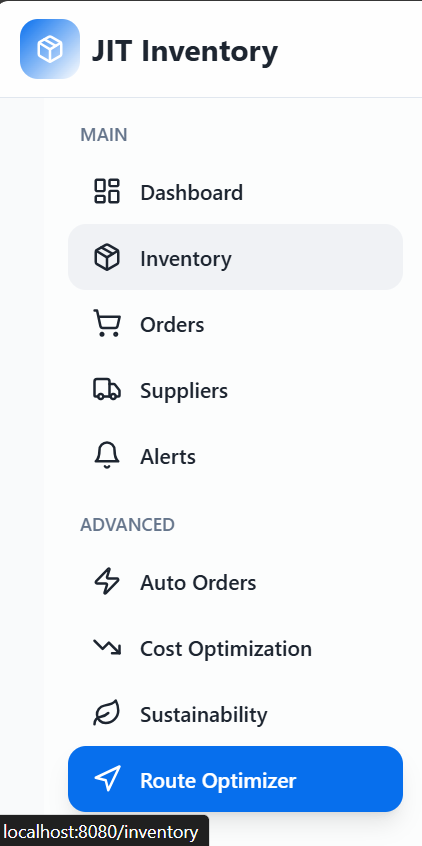
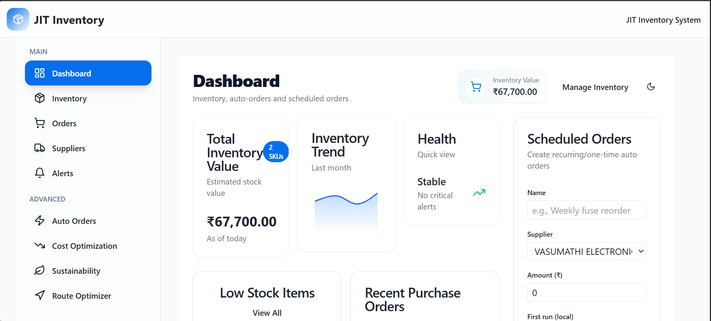
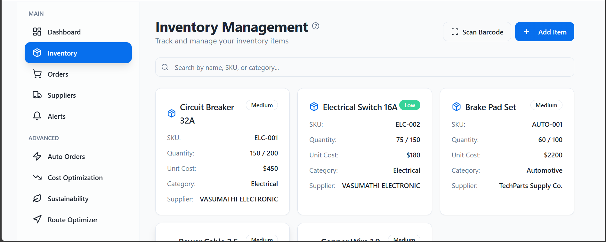
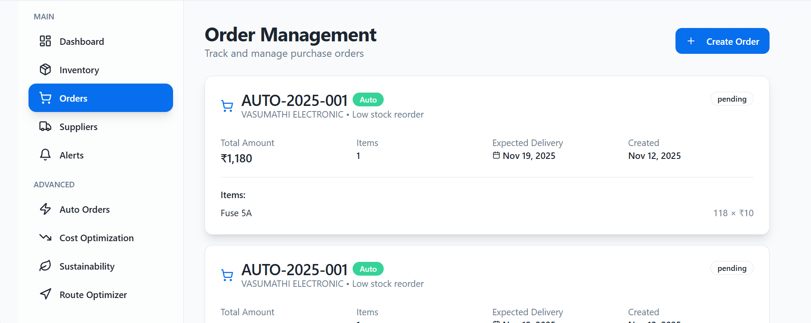
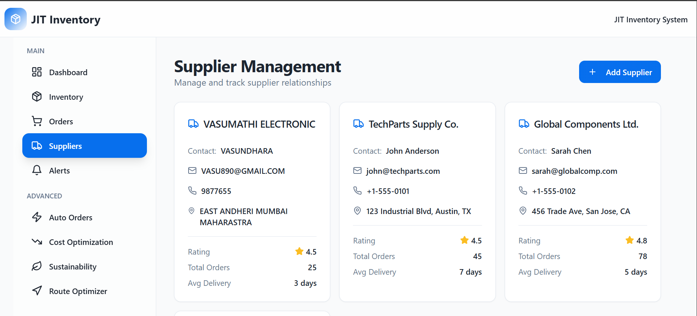
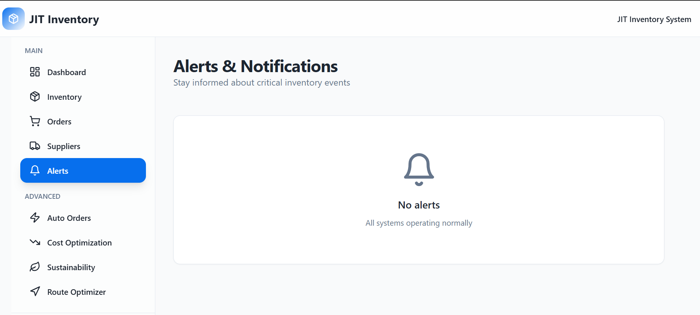
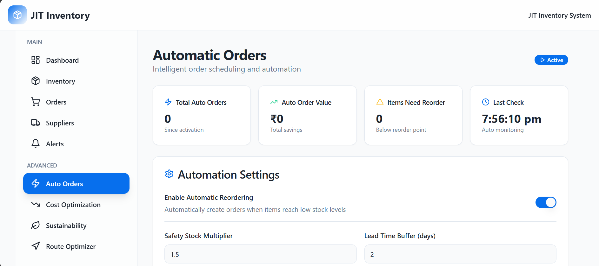
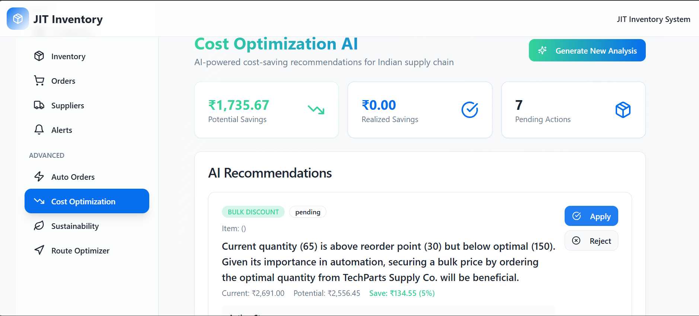

# JIT Inventory Management System

Built by / Team Members:

- Balaji R
- Nithin P Gowda
- Prajwal S K
- Shashank N (TEAM LEAD)

A comprehensive Just-In-Time (JIT) inventory management system built with React, TypeScript, and modern web technologies. This system provides real-time inventory tracking, supplier management, order processing, and advanced analytics for efficient inventory control.

## 🚀 Project Overview

The JIT Inventory Management System is designed to optimize inventory levels, reduce carrying costs, and improve supply chain efficiency. It provides real-time insights, automated reordering capabilities, and intelligent demand forecasting to help businesses maintain optimal stock levels.

## ✨ Key Features

### 📊 **Dashboard & Analytics**
- Real-time inventory valuation and tracking
- Interactive charts and visualizations
- AI-powered demand forecasting
- Cost optimization recommendations
- Supplier performance metrics
- Inventory turnover analysis

### 📦 **Inventory Management**
- Comprehensive item tracking with SKUs and barcodes
- Real-time stock level monitoring
- Automated low-stock alerts
- Multi-category organization (Electrical, Automotive, Cables, Wires)
- Location-based inventory tracking
- GST and HSN code management

### 🏢 **Supplier Management**
- Complete supplier profiles and contact information
- Performance rating and delivery tracking
- Order history and analytics
- Supplier comparison tools
- Communication management

### 📋 **Order Management**
- Purchase order creation and tracking
- Multi-item order support
- Delivery date management
- Order status tracking (Pending, In Transit, Delivered, Cancelled)
- Cost calculation and reporting

### 🔔 **Smart Alerts & Notifications**
- Low stock warnings
- Reorder point notifications
- Delivery reminders
- Overstock alerts
- Performance notifications

## 🛠️ Technology Stack

### **Frontend**
- **React 18** - Modern UI framework
- **TypeScript** - Type-safe development
- **Vite** - Fast build tool and dev server
- **Tailwind CSS** - Utility-first CSS framework
- **shadcn/ui** - Beautiful, accessible UI components
- **Recharts** - Data visualization library
- **Lucide React** - Icon library

### **State Management**
- React Hooks (useState, useEffect)
- Context API for global state
- Local state management

### **Styling & UI**
- Tailwind CSS for styling
- shadcn/ui component library
- Responsive design
- Dark/light theme support
- Custom Indian localization

### **Development Tools**
- ESLint for code linting
- TypeScript for type checking
- Hot Module Replacement (HMR)
- Modern ES6+ features

## 🧠 Why TypeScript (and these choices)

### TypeScript
- Reliability: catches class of runtime bugs at build-time with static types.
- Developer Velocity: rich IntelliSense, auto-complete, and refactors across a large UI surface.
- Domain Modeling: models inventory, orders, suppliers with discriminated unions/interfaces.
- Safer Refactors: changes to shared components ripple type errors instead of silent failures.
- Interop: gradual typing allows adopting third-party JS libs safely.

### Vite + React (SWC)
- Fast feedback: lightning dev server + HMR keeps iteration sub-second.
- Modern bundling: first-class ESM, code-splitting, tree-shaking.
- TS-first DX: no extra config for TS/JSX; SWC transforms are fast.

### Tailwind CSS + shadcn/ui
- Speed + consistency: design tokens and utilities keep UI consistent.
- Accessibility: shadcn/ui built on Radix primitives (focus management, ARIA).
- Theming: CSS variables enable dark mode and brand customization.

## 🏗️ Architecture & Decisions
- Pages in `src/pages` own features/screens; small, reusable parts live in `src/components`.
- UI System: `src/components/ui` wraps shadcn primitives for consistent props/variants.
- Lib: `src/lib` holds cross-cutting utilities (Indian localization, GST helpers). 
- Integrations: `src/integrations/supabase` encapsulates client and types for data access.
- Routing: React Router for page navigation; dashboards compose widgets (cards, charts).

## ⚡ Performance & UX
- Lightweight charts (Recharts) and memoized selectors for KPIs.
- Code-splitting via Vite ESM; only what’s used is shipped.
- Pure-functional components and Tailwind avoid heavy CSS runtimes.

## ♿ Accessibility & i18n
- Keyboard-friendly components (Radix under the hood), focus rings, ARIA attributes.
- Indian locale utilities: `formatINR`, GST helpers, pincode validation.

## ✅ Quality: Linting, Types & Testing
- ESLint + TypeScript keep code uniform; some rules relaxed for demo speed.
- Recommended test stack: Vitest + React Testing Library (add later as needed).

## 🔐 Configuration & Environment
- Create `.env` with your keys (example keys included for demo). For production, store secrets securely.
- Supabase vars: `VITE_SUPABASE_URL`, `VITE_SUPABASE_PUBLISHABLE_KEY`, `VITE_SUPABASE_PROJECT_ID`.

## 🚢 Build & Deploy
- Build: `npm run build` outputs to `dist/`.
- Preview: `npm run preview` to serve the production build locally.
- Deploy on any static host (Netlify, Vercel, Cloudflare Pages, S3+CF).

## 📁 Project Structure

```
jitflow-prime/
├── public/                 # Static assets
├── src/
│   ├── components/         # Reusable UI components
│   │   ├── ui/            # shadcn/ui components
│   │   ├── Layout.tsx     # Main layout component
│   │   ├── WidgetCard.tsx # Dashboard widgets
│   │   └── ...
│   ├── pages/             # Main application pages
│   │   ├── Dashboard.tsx  # Analytics dashboard
│   │   ├── Inventory.tsx  # Inventory management
│   │   ├── Orders.tsx     # Order management
│   │   ├── Suppliers.tsx  # Supplier management
│   │   └── ...
│   ├── hooks/             # Custom React hooks
│   ├── lib/               # Utility functions
│   │   ├── utils.ts       # General utilities
│   │   └── indianLocalization.ts # Indian currency formatting
│   ├── integrations/      # External service integrations
│   │   └── supabase/      # Database integration
│   ├── App.tsx            # Main application component
│   └── main.tsx           # Application entry point
├── supabase/              # Database configuration
├── package.json           # Dependencies and scripts
└── README.md              # Project documentation
```

## 🚀 Getting Started

### Prerequisites
- Node.js (v16 or higher)
- npm or yarn package manager

### Installation

1. **Clone the repository**
   ```bash
   git clone <repository-url>
   cd jitflow-prime
   ```

2. **Install dependencies**
   ```bash
   npm install
   ```

3. **Start the development server**
   ```bash
npm run dev
```

4. **Open your browser**
   Navigate to `http://localhost:8080` to view the application

### Available Scripts

```bash
npm run dev          # Start development server
npm run build        # Build for production
npm run preview      # Preview production build
npm run lint         # Run ESLint
```

## 📊 Sample Data

The system comes pre-loaded with comprehensive sample data:

### **Suppliers (4)**
- VASUMATHI ELECTRONIC (Mumbai, India)
- TechParts Supply Co. (Austin, TX)
- Global Components Ltd. (San Jose, CA)
- FastShip Logistics (Chicago, IL)

### **Inventory Items (5)**
- Circuit Breaker 32A (Electrical)
- Electrical Switch 16A (Electrical)
- Brake Pad Set (Automotive)
- Power Cable 2.5 sqmm (Cables)
- Copper Wire 1.0 sqmm (Wires)

### **Purchase Orders (4)**
- PO-2024-001: Electrical components (Pending)
- PO-2024-002: Automotive parts (In Transit)
- PO-2024-003: Bulk cables (Delivered)
- PO-2024-004: Wire supplies (Cancelled)

## 🎯 Key Metrics & Analytics

### **Dashboard Analytics**
- **Total Inventory Value**: ₹2,97,000
- **Active Orders**: 2
- **Low Stock Alerts**: 2 items
- **Average Supplier Rating**: 4.6/5.0
- **Inventory Turnover**: 8.5 times/year
- **Upcoming Deliveries**: 1 within 7 days

### **Performance Indicators**
- Stock level monitoring
- Supplier delivery performance
- Order fulfillment rates
- Cost optimization opportunities
- Demand forecasting accuracy

## 🔧 Configuration

### **Environment Setup**
The application uses hardcoded data for demonstration purposes. In production, you would configure:

- Database connections
- API endpoints
- Authentication systems
- External service integrations

### **Customization**
- Modify sample data in component files
- Update styling with Tailwind CSS
- Add new features using the existing component structure
- Extend analytics with additional charts and metrics

## 📱 Responsive Design

The application is fully responsive and optimized for:
- Desktop computers
- Tablets
- Mobile devices
- Various screen resolutions

## 🎨 UI/UX Features

- **Modern Design**: Clean, professional interface
- **Intuitive Navigation**: Easy-to-use sidebar navigation
- **Interactive Charts**: Real-time data visualization
- **Status Indicators**: Color-coded status badges
- **Progress Bars**: Visual progress tracking
- **Hover Effects**: Enhanced user interaction
- **Loading States**: Smooth user experience

## 🔮 Future Enhancements

### **Planned Features**
- User authentication and role management
- Real-time database integration
- Advanced reporting and exports
- Mobile application
- API integrations
- Automated reordering
- Barcode scanning
- Multi-location support

### **Advanced Analytics**
- Predictive analytics
- Machine learning insights
- Advanced forecasting
- Cost optimization algorithms
- Performance benchmarking

## 🤝 Contributing

1. Fork the repository
2. Create a feature branch (`git checkout -b feature/AmazingFeature`)
3. Commit your changes (`git commit -m 'Add some AmazingFeature'`)
4. Push to the branch (`git push origin feature/AmazingFeature`)
5. Open a Pull Request

## 📄 License

This project is licensed under the MIT License — see [LICENSE](./LICENSE) for details.

## 📞 Support

For support and questions:
- Create an issue in the repository
- Contact the development team
- Check the documentation

## 🏆 Acknowledgments

- Built with modern web technologies
- UI components from shadcn/ui
- Icons from Lucide React
- Charts from Recharts
- Styling with Tailwind CSS

---

**JIT Inventory Management System** - Optimizing inventory for the modern supply chain.

## 🖼️ Screenshots

### 1) Sidebar Navigation

The sidebar provides a clear, persistent navigation surface for the application: top-level sections (Dashboard, Inventory, Orders, Suppliers, Alerts) plus advanced tools beneath (Auto Orders, Cost Optimization, Sustainability, Route Optimizer). It’s designed for quick context switches, with icons and active-state highlighting so warehouse staff can move between workflows without losing place or context.

### 2) Inventory List View

This screen shows the inventory listing with search, filters, and quick actions for each SKU. You can scan or search items, view current on-hand and reorder levels, and trigger actions (adjust quantity, create PO). The layout prioritizes important columns and uses badges to surface low-stock items and critical metadata at a glance.

### 3) Item Detail / Stock Card

An item detail pane consolidates SKU data, location, recent movements, and supplier info. Users can view reorder points, safety stock calculations, and purchase history to decide replenishment. The card presents actionable controls (create order, move stock) and contextual metrics so operations teams can resolve stock issues quickly without navigating through multiple screens.

### 4) Orders & Fulfillment

The Orders view lists purchase and sales orders with status indicators (Pending, In Transit, Delivered). Each row exposes order items, timelines, and quick links to related supplier or inventory records. This page makes it straightforward to track fulfillment, update statuses, and coordinate receiving or dispatching with expected arrival windows.

### 5) Supplier Management

Supplier profiles and performance metrics live here: contact details, lead times, and rating history. The interface supports comparing suppliers, viewing past lead-time variance, and selecting preferred suppliers for automated reorders. This helps procurement teams balance cost and reliability when placing repeat or bulk orders.

### 6) Auto Orders / Automation Rules

The Auto Orders screen surfaces automation rules and suggested purchases calculated from usage trends and reorder points. Users can review, approve, or tweak suggested quantities and suppliers before an automated purchase order is created. The workflow reduces manual work by turning repeat reordering into a monitored, auditable process.

### 7) Route Optimizer

This page visualizes optimized delivery or pickup routes on a map, grouping stops and showing estimated times. The optimizer factors locations, priorities, and delivery windows to generate efficient sequences. It’s useful for planning pickups from multiple suppliers or scheduling last-mile deliveries to customers with minimal driving time.

### 8) Dashboard KPIs

High-level dashboard tiles and charts summarize inventory value, low-stock counts, supplier health, and recent order activity. The visualizations help managers quickly assess business health, spot trends, and prioritize actions (e.g., urgent reorder, supplier follow-up). KPIs are refreshed to reflect current sample data or live integrations.